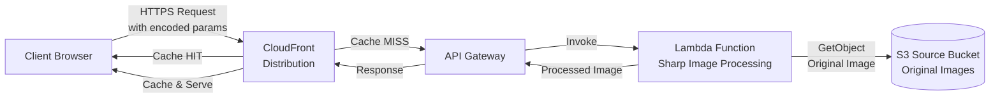
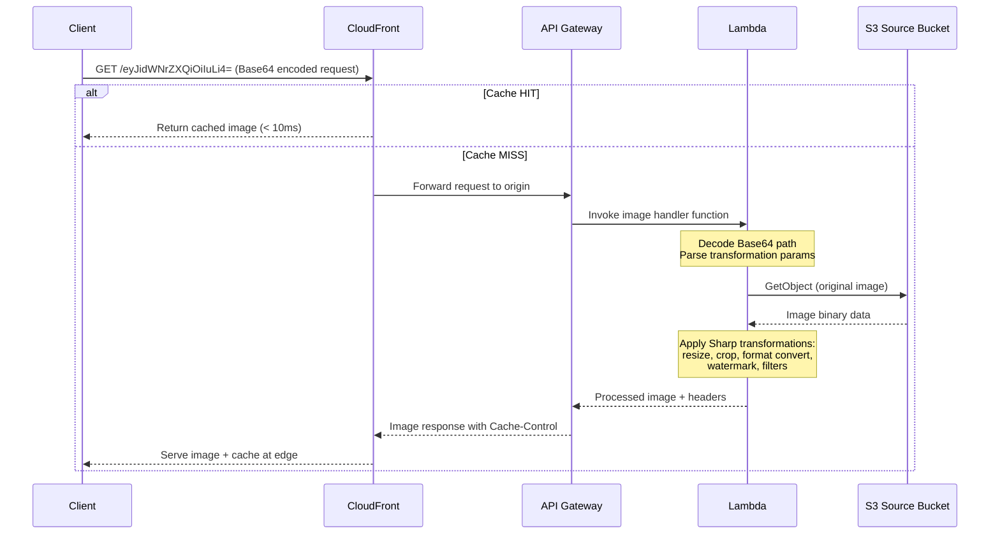
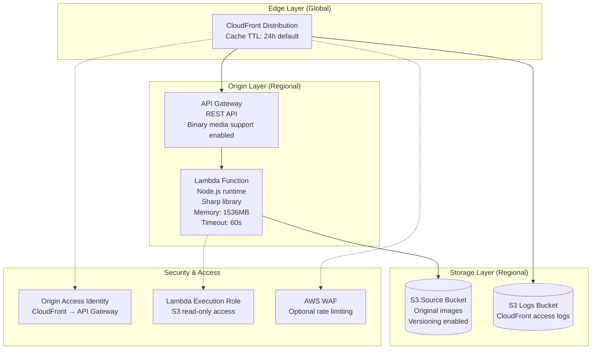
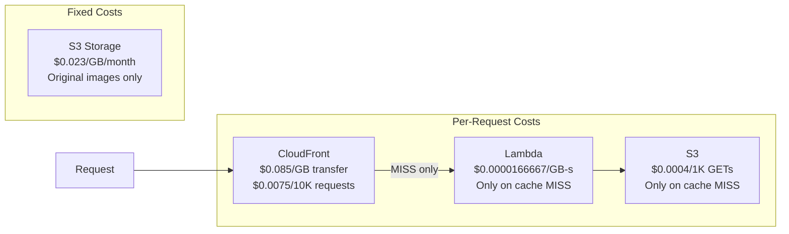

# Serverless Image Handler: Architecture Diagram

## High-Level Architecture



## Detailed Data Flow



## Component Details



## Request Encoding Format

The URL path carries the full transformation specification as Base64-encoded JSON:

```
https://<distribution>.cloudfront.net/<base64-encoded-json>
```

Decoded JSON structure:

```json
{
  "bucket": "source-bucket-name",
  "key": "path/to/image.jpg",
  "outputFormat": "webp",
  "edits": {
    "resize": { "width": 400, "height": 300, "fit": "cover" },
    "grayscale": true,
    "rotate": 90
  }
}
```

## Cost Flow



The CloudFront cache is the primary cost optimization lever. Higher cache-hit ratios mean fewer Lambda invocations and S3 reads.
