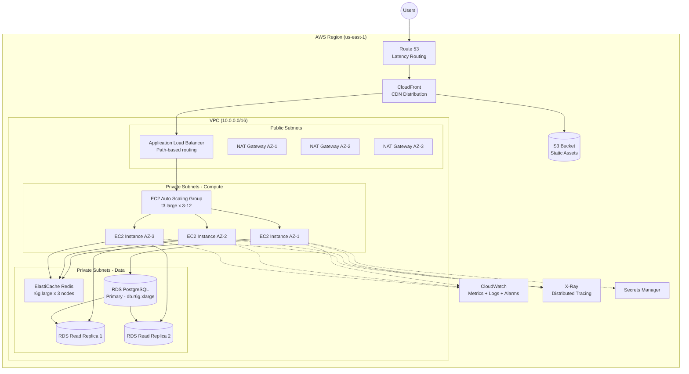
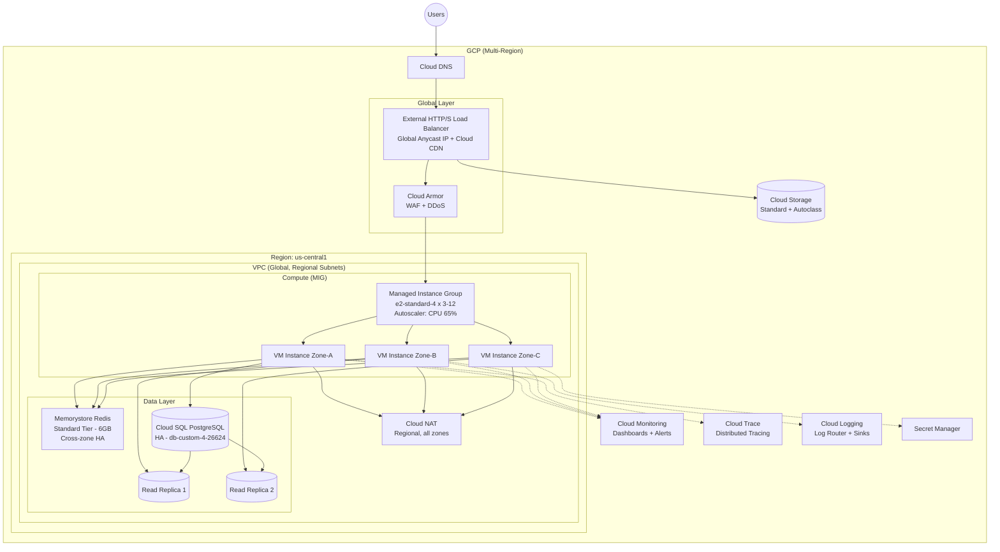

# Cross-Cloud Translation Exercise: AWS to GCP

## Objective

Translate a production-grade 3-tier AWS architecture into its GCP equivalent. This exercise builds muscle memory for identifying service mappings and understanding behavioral differences between the two clouds.

---

## The AWS Architecture

A mid-size e-commerce platform serving 50,000 concurrent users with the following requirements:

- High availability across multiple availability zones
- Auto-scaling based on CPU and request count
- Relational database with read replicas
- In-memory caching for session management and frequent queries
- Static asset storage with CDN delivery
- Centralized monitoring and alerting

### AWS Service Stack

| Layer | Service | Configuration |
|-------|---------|---------------|
| DNS & CDN | Route 53 + CloudFront | Latency-based routing, HTTPS termination |
| Load Balancing | Application Load Balancer (ALB) | Path-based routing, cross-AZ |
| Compute | EC2 Auto Scaling Group | t3.large, min 3 / max 12, target tracking on CPU 65% |
| Caching | ElastiCache (Redis cluster mode) | r6g.large, 3-node cluster, Multi-AZ |
| Database | RDS PostgreSQL Multi-AZ | db.r6g.xlarge, 1 primary + 2 read replicas |
| Object Storage | S3 | Standard class, lifecycle to IA after 90d |
| Monitoring | CloudWatch + X-Ray | Custom dashboards, APM traces, alarms |
| Secrets | Secrets Manager | Auto-rotation every 30 days |
| Networking | VPC, 3 public + 3 private subnets | NAT Gateway per AZ, Security Groups + NACLs |

### AWS Architecture Diagram

---

## Your Task: Translate to GCP

For each AWS service in the architecture, identify the GCP equivalent and note any behavioral differences that would affect the design.

### Translation Template

Fill in the GCP column:

| Layer | AWS Service | GCP Equivalent | Notable Differences |
|-------|-------------|----------------|---------------------|
| DNS & CDN | Route 53 + CloudFront | _________________ | |
| Load Balancing | ALB (regional, cross-AZ) | _________________ | |
| Compute | EC2 Auto Scaling Group | _________________ | |
| Caching | ElastiCache Redis | _________________ | |
| Database | RDS PostgreSQL Multi-AZ | _________________ | |
| Object Storage | S3 | _________________ | |
| Monitoring | CloudWatch + X-Ray | _________________ | |
| Secrets | Secrets Manager | _________________ | |
| Networking | VPC (regional) + 3 AZs | _________________ | |
| NAT | NAT Gateway (per AZ) | _________________ | |
| Firewall | Security Groups + NACLs | _________________ | |

### Questions to Answer While Translating

1. Which GCP component eliminates the need for a DNS-level latency routing strategy?
2. How does GCP's VPC model differ from AWS when deploying across zones?
3. What automatic cost optimization does GCP provide for long-running VMs without any commitment purchase?

---

## Hints / Mapping Table

Use these hints if you get stuck:

| AWS Concept | Hint | GCP Service Category |
|-------------|------|---------------------|
| Route 53 + CloudFront | GCP's LB is already global — CDN attaches to the same LB | Cloud Load Balancing + Cloud CDN |
| ALB | Think "global" not "regional" — single anycast IP worldwide | External HTTP(S) Load Balancer |
| EC2 ASG | Called "instance groups" in GCP, with similar auto-healing | Managed Instance Group (MIG) |
| ElastiCache Redis | Same engine, different name | Memorystore for Redis |
| RDS PostgreSQL | Direct equivalent exists, but consider AlloyDB for performance | Cloud SQL for PostgreSQL |
| S3 | Almost identical service with different naming | Cloud Storage |
| CloudWatch | Split into separate products on GCP | Cloud Monitoring + Cloud Logging |
| X-Ray | OpenTelemetry-native on GCP | Cloud Trace |
| NAT Gateway | One NAT handles all zones in the region | Cloud NAT |
| Security Groups | Firewall rules are VPC-level, not instance-level | VPC Firewall Rules |

---

## Solution

### GCP Equivalent Architecture

| Layer | AWS Service | GCP Equivalent | Notable Differences |
|-------|-------------|----------------|---------------------|
| DNS & CDN | Route 53 + CloudFront | Cloud DNS + Cloud CDN | Cloud CDN is enabled on the LB backend, not a separate distribution. No "behaviors" to configure. |
| Load Balancing | ALB (regional) | External HTTP(S) Load Balancer (global) | Single anycast IP serves all regions globally. No need for latency-based DNS routing. Built-in DDoS protection. |
| Compute | EC2 Auto Scaling Group | Managed Instance Group (MIG) | MIGs support rolling updates with canary. Custom machine types allow exact vCPU/RAM sizing. Live Migration avoids restarts for host maintenance. |
| Caching | ElastiCache Redis | Memorystore for Redis | Standard Tier provides cross-zone replication. No cluster mode equivalent — scale vertically to 300GB. Redis 7.0 supported. |
| Database | RDS PostgreSQL Multi-AZ | Cloud SQL for PostgreSQL | HA configuration uses regional persistent disk (synchronous). Read replicas can be cross-region. Consider AlloyDB for 4x throughput. |
| Object Storage | S3 | Cloud Storage | Unified bucket namespace (globally unique). Uniform bucket-level access replaces ACLs. Autoclass for automatic lifecycle. |
| Monitoring | CloudWatch + X-Ray | Cloud Monitoring + Cloud Logging + Cloud Trace | Ops Agent for custom metrics. Cloud Trace is OpenTelemetry-native. Integrated profiler (Cloud Profiler) included at no extra cost. |
| Secrets | Secrets Manager | Secret Manager | Simpler API. Manual rotation (use Cloud Functions for automation). IAM-based access control, no resource policies. |
| Networking | VPC (regional) + 3 AZs | VPC (global) + 3 zones | VPC is global — subnets are regional. Same VPC can span all regions without peering. Shared VPC for multi-project. |
| NAT | NAT Gateway (per AZ) | Cloud NAT (per region) | Single Cloud NAT covers all zones in the region. No NAT instance to manage. Configurable port allocation per VM. |
| Firewall | Security Groups + NACLs | VPC Firewall Rules + Firewall Policies | Network tags or service accounts as targets (not tied to instances like SGs). Hierarchical policies at org/folder level. |

### GCP Architecture Diagram

---

## Key Architectural Differences in This Translation

### What Simplified on GCP

1. **Load balancing is global by default** — eliminates the need for Route 53 latency-based routing + multiple regional ALBs. One anycast IP handles worldwide traffic distribution.
2. **VPC is global** — no need to create separate VPCs per region or peer them. Subnets are regional but the VPC spans all regions automatically.
3. **Cloud NAT is regional** — one Cloud NAT resource covers all zones in a region (AWS requires one NAT Gateway per AZ for HA).
4. **Sustained Use Discounts are automatic** — no commitment purchase needed for up to 30% discount on VMs running >25% of the month.

### What Got More Complex on GCP

1. **Firewall model** — GCP firewall rules use network tags or service accounts as targets, which is flexible but requires careful tag management. No direct "security group" reference from another security group.
2. **Secret rotation** — requires building automation with Cloud Functions (AWS Secrets Manager has native rotation lambdas for supported services).
3. **Redis clustering** — Memorystore Standard Tier does not support cluster mode. For >300GB workloads, you need Memorystore for Redis Cluster (separate product with different API).

---

## Discussion Questions

### 1. Global Load Balancing Economics

GCP's global HTTP(S) Load Balancer uses a single anycast IP to route traffic to the nearest healthy backend. AWS achieves similar behavior by combining Route 53 (latency routing) + multiple regional ALBs + CloudFront.

**Question:** How does GCP's global LB approach affect your cost model compared to the AWS multi-component approach? Consider: number of billable resources, data processing charges, cross-region data transfer costs, and the operational cost of managing fewer resources. What scenario would still favor the AWS multi-regional ALB approach?

### 2. VM Maintenance and Availability

GCP Compute Engine performs Live Migration by default — VMs are moved to a new host during maintenance events without rebooting. AWS EC2 instances are stopped and restarted during host maintenance (scheduled maintenance events).

**Question:** How does Live Migration change your application's availability design? Can you reduce your minimum instance count (from 3 to 2) in the MIG knowing that maintenance events won't cause instance loss? What workloads would you explicitly disable Live Migration for (using `TERMINATE` maintenance policy), and why?

### 3. Pricing Model Implications for Auto-Scaling

GCP offers Sustained Use Discounts (automatic, up to 30% off for VMs running >25% of the month) and per-second billing (minimum 1 minute). AWS offers Reserved Instances and Savings Plans (commitment-based, up to 72% off) with per-second billing (minimum 1 minute for Linux).

**Question:** For a workload with a stable baseline of 4 instances and peak scaling to 12 instances daily, calculate the effective discount each platform provides without purchasing any commitments. Then compare: at what baseline utilization level does an AWS 1-year Savings Plan become more cost-effective than GCP's automatic Sustained Use Discounts? What does this imply for your capacity planning strategy on each cloud?
